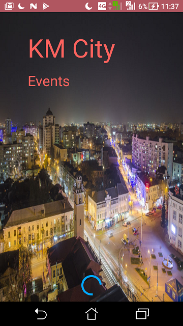
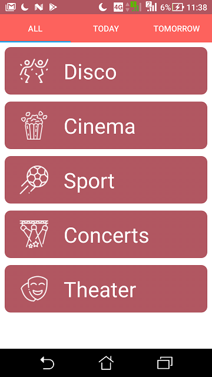
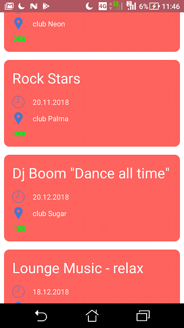

# KM Events App
Kotlin, Android SDK, Firebase(Authentication, Database, Storage), Glide, Fragments, RecyclerView, ConstraintLayout, DatePicker, TimePicker. 

This app helps you find events in Khmelnitskiy city. (Test project with dummy data)

## View
<table align="left" width="100%">
  <tbody>
    <tr>
      <td colspan="1">  </td>
      <td colspan="1">  </td>
      <td colspan="1">  </td>
      <td colspan="1">  </td>
      <td colspan="1">  </td>
    </tr>
  </tbody>
</table>

## Version
0.01
## Built With
* Android Studio
* Kotlin

## How to install
Check available apk file into [realises](https://github.com/parnekov/KM-Events-App/releases).

If it isn't contain necessary files that you need you can just install using the next steps:

1. Install [android studio](https://developer.android.com/studio/)
2. Clone or download project from [github](https://github.com/parnekov/KM-Events-App/)
3. Run app from android studio -> install on phone
